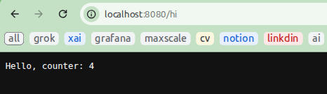
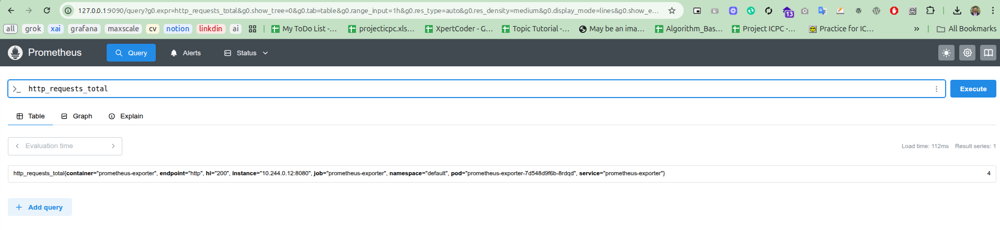
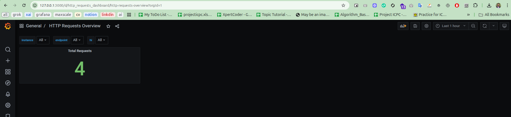

# Prometheus Monitoring Setup with Kubernetes

This guide provides step-by-step instructions to set up a Prometheus monitoring stack on a Kubernetes cluster, deploy a sample application with metrics, and visualize the metrics using Prometheus and Grafana.

## Prerequisites

- A running Kubernetes cluster
- `kubectl` configured to interact with the cluster
- `helm` installed

## Installation Steps

### 1. Install Prometheus Stack

Add the Prometheus community Helm chart repository, update it, and install the `kube-prometheus-stack` in the `monitoring` namespace.

```bash
helm repo add prometheus-community https://prometheus-community.github.io/helm-charts
helm repo update
helm install prometheus prometheus-community/kube-prometheus-stack -n monitoring --set grafana.image.tag=7.5.5 --create-namespace
```

This command deploys Prometheus, Grafana, and related components with Grafana version 7.5.5.

### 2. Verify Prometheus Pods

Ensure all Prometheus-related pods are running in the `monitoring` namespace.

```bash
kubectl get pods -n monitoring
```

Check that all pods show a `Running` status before proceeding.

### 3. Deploy the Sample Application

Deploy a sample application (including a Deployment, Service, and ServiceMonitor) from the `./helm` directory. The application exposes a metric named `http_requests_total` on the `/metrics` endpoint.

```bash
kubectl apply -f ./helm/deploy.yaml
```

### 4. Test the Application

Port-forward the application service to access it locally.

```bash
kubectl port-forward service/prometheus-exporter 8080:8080
```

Open a browser and visit `http://localhost:8080/hi`. Refresh the page multiple times to increment the `http_requests_total` counter.



### 5. Access Prometheus and Grafana

Port-forward the Prometheus and Grafana services to access their web interfaces.

#### Prometheus
```bash
kubectl port-forward -n monitoring service/prometheus-kube-prometheus-prometheus 9090:9090
```

Visit `http://127.0.0.1:9090` in your browser. Query the `http_requests_total` metric to verify the application's metrics are being scraped.


#### Grafana
```bash
kubectl port-forward -n monitoring service/prometheus-grafana 3000:80
```

Visit `http://127.0.0.1:3000` and log in with the following credentials:
- **Username**: `admin`
- **Password**: `prom-operator`

### 6. Import Grafana Dashboard

In Grafana, import the dashboard configuration from `./grafana/dashboard.json`:
1. Navigate to the Grafana UI (`http://127.0.0.1:3000`).
2. Go to **Dashboards** > **Import**.
3. Upload the `dashboard.json` file or paste its contents.
4. Save and view the dashboard to visualize the `http_requests_total` metrics.

5. 
## Cleanup

To remove the Prometheus stack and application:
```bash
helm uninstall prometheus -n monitoring
kubectl delete -f ./helm/deploy.yaml
kubectl delete namespace monitoring
```


